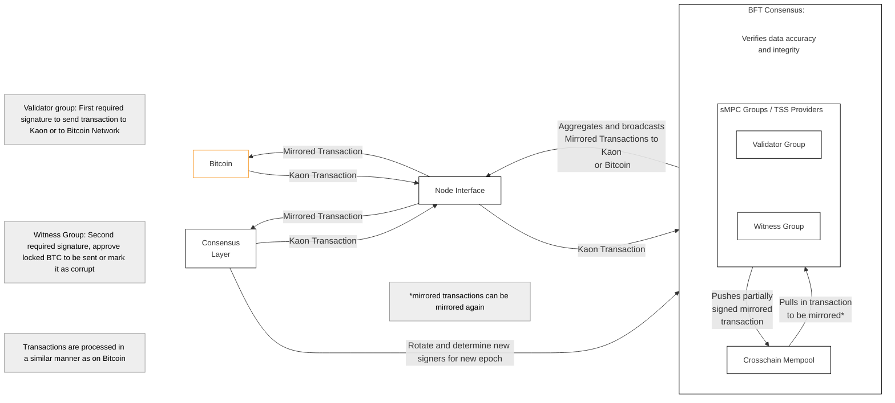
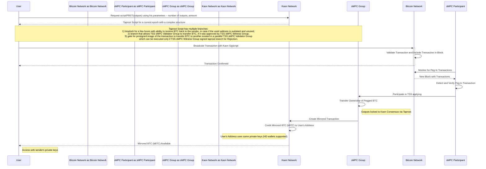
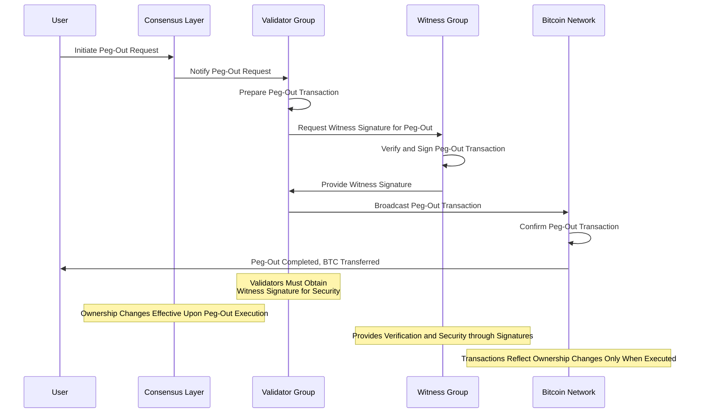
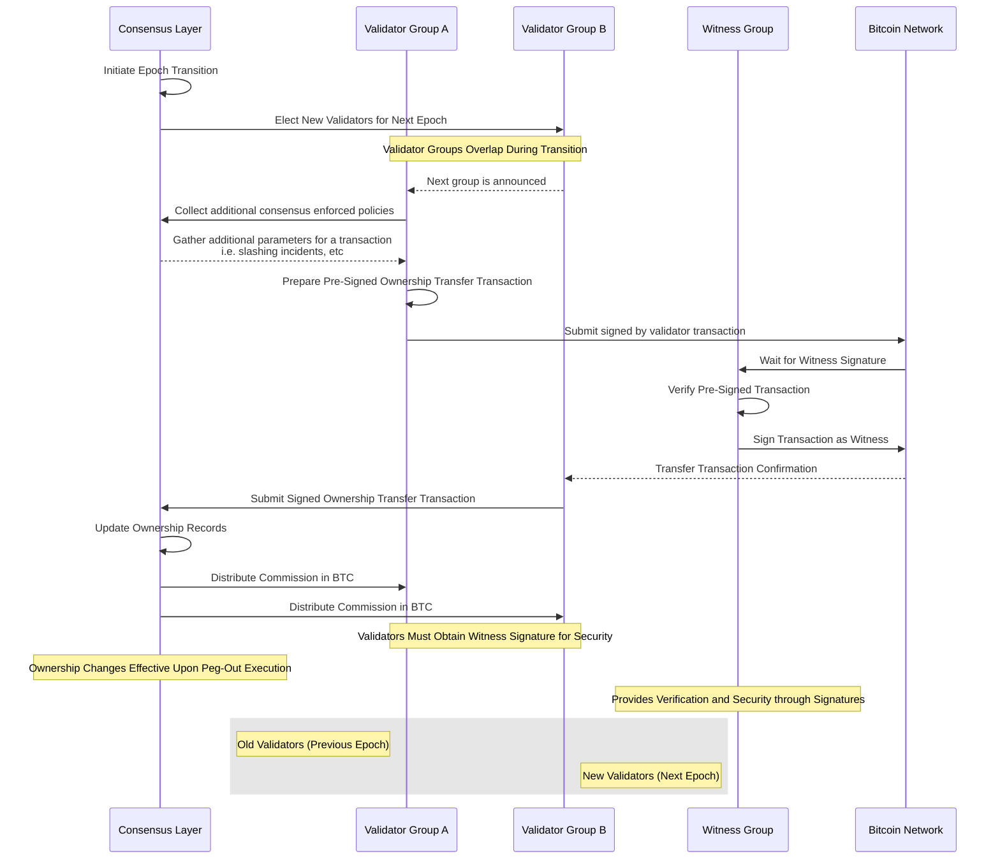
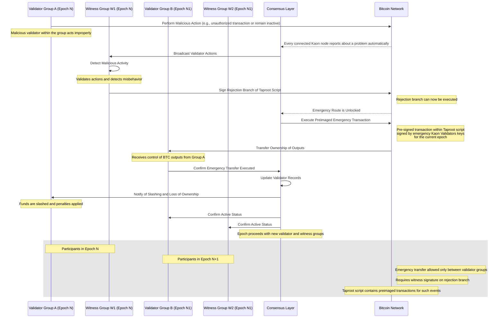
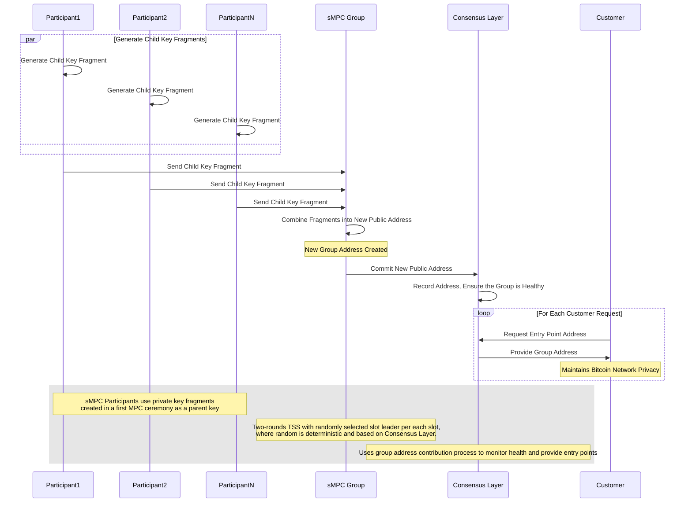

# Overview
Kaon is a Bitcoin-native L1 blockchain with EVM composability, built by a security-first team to address systemic security risks inherent in bridge-, multisig-, oracle-, and rollup-based designs. 

Current solutions either rely on centralized parties and points of failures, or do not allow for seamless integration of EVM environments within a UTXO model framework. All these are hindering the growth and potential of the BTC ecosystem. 

Our mission is to solve these systemic issues. The result is a bridge-less and oracle-less essential infrastructure layer that not only offers the first cryptographically secure wrapped BTC, but goes further and makes Bitcoin interoperability secure, composable and scalable. 

Kaon’s consensus model, UTXO native design, and UTXO and EVM information handling allows it  to give the user a combination of important functionalities that are unique only to Kaon. Some of the more pertinent ones include:
- Avoiding centralisation risk
- Having control over the entire transaction process
- Maintaining the same security and privacy standards as Bitcoin

All while enjoying seamless integration between EVM environments and the UTXO model. Please note - this document is a working draft, and will be continuously updated and improved upon during the development cycle. 

# Terminology and Architectural Foundation

## Terminology
| General Terminology | Definition |
|------|-----|
| Consensus    | Consensus is a fundamental property of distributed systems where multiple entities must collectively agree on a single value, validate their states, and terminate the decision process - this cannot be guaranteed deterministically in asynchronous systems with arbitrary failures. ([source](https://arxiv.org/pdf/2409.17627))|
|  Output (UTXO)  |  Single-use batch of Bitcoin that must meet a specific set of conditions in order to be spent.  |
|  Hierarchical Deterministic (HD) Wallets  |  Cryptographic wallets that generate an infinite number of keys arranged in a tree structure from a single master seed - typically represented as a mnemonic word sequence - where parent keys can derive child keys, which can derive their own child keys, and so on.  |
|  Invoice Address  |  A single-use token that identifies a Bitcoin transaction's target based on Hierarchical Deterministic Keys; used to prevent address [re-use](https://en.bitcoin.it/wiki/Address_reuse) and to protect user privacy.  |
|  Partially Signed Bitcoin Transaction (PBST)  |  A Bitcoin standard introduced in [BIP 174](https://github.com/bitcoin/bips/blob/master/bip-0174.mediawiki) for transactions that are not yet fully signed, designed to improve the interoperability between different wallets, making it easier to conduct complex transactions that require multiple signatures.   |
|  Pre-Signed Transaction Hash (Payment Preimage)  |  A cryptographic mechanism using hash preimage revelation to prove payment authorization, originally from Lightning Network and adapted for Bitcoin with Taproot signatures to enable secure conditional rollback transactions.  |

| Kaon's Terminology | Definition |
|------|-----|
| Delegated Proof of Stake (dPoS)    | Incentivize users to confirm network data and ensure security through a process of collateral staking with an additional use of witnesses (formally called delegates).   |
|  Delegate Stakes  |  A transaction with specific lock script used in Kaon's dPoS to give a user an ability to participate in the chain's management,  can be combined or delegated. |
|  Masternode  |  Node connected to a wallet of Stakeholder  |
|  Byzantine Fault Tolerance (BFT) Consensus  | Non-optimistic provably safe proof-of-stake binary consensus augmented to offer a proof of settlement and distributed key generation (DKG) through deterministic process where its participants take turns round-robin fashion, its consistency and liveness assuming a number of Byzantine corruptions did not exceeded 1/2, and it has the ability to converge back to safety once synchrony is restored.   |
|  Treshold Signature Scheme (TSS)  |  A method to collectively produce signature where every participant holds only a fragment of a private key, in Kaon's case utilizing Schnorr signature, Shamir Secret Sharing, Simple Coins as a source of deterministic random and Lagrange interpolation.  |
|  Safe Multiparty Computation (sMPC)   |  Secure multiparty computation (MPC / SMPC) is a cryptographic protocol that distributes a computation across multiple parties (in Kaon’s case secret message sequences or SMSs) where no individual party can see the other parties’ data.  |
|  Epoch   |  Iteration of 80 blocks 13.(3) minutes long with a strict lifecircle, where election of validators for the next iteration is happened, allowing the BFT consensus to have non-fixed pool of participants in a determenistic manner. |
|  sMPC Group   |  A set of participants determined by the BFT consensus for the current epoch from the approved set of validators of the current epoch as determined by dPoS consensus.  |
|  Witness Group   |  sMPC Group with a specific role to approve locked BTCs to be sent or to mark it as corrupt.  |
|  Validator Group   |  sMPC Group with a specific role to maintain lock over received BTCs and to send it, which could be executed only after the related Witness Group approval. |
|  Peg In  |  Process of locking BTC in Bitcoin Network to get mirrored BTCs or to perform extended logic.  |
|  Peg Out  |  Process of sending BTC out of Kaon Network's locking mechanic to a user within the Bitcoin Network.   |
|  Sweeping  |  Process of delegating BTC locks maintained by Validator and Witness Groups of the previous Epoch to sMPC Groups of the current Epoch.  |
|  Slashing  |  Execution of validator or group of validators with confiscation of their stakes in case of detected and proven malicious activities, maintained by Kaon's Consensus Layer.  |
|  Mirrored Transaction |  Transactions that move in either direction - from Bitcoin to Kaon's Consensus Layer or vice versa - when specific instructions are included in the transaction outputs. |
|  Mirrored BTC |  Bitcoin representation in Kaon's Consensus Layer produced by Mirrored Transaction through the Peg In process.  |

## Architecture
### Global Components
| Component | Description |
|------|-----|
| Consensus Layer    | L1 system that provides BFT by randomly selecting and rotating participants (validators) that help reach consensus and solve incidents. |
| Node Interface    | Wraps original node to trigger logic when receiving transactions and helps compose transactions for signing. |
| Cross Chain Mempool    | Ensures deterministic transaction relaying, by using UTXO features (outputs).|
| BFT Consensus Layer    | Orchestrates data flows between all connected chains by setting up a framework of possible interactions and roles or all participants. |
### BFT Internal Components
| Component | Description |
|------|-----|
| Epoch   | Determines validator selection for the next iteration, allowing BFT consensus to maintain a deterministic yet dynamic participant pool. |
| sMPC Group    | A coordinated set of nodes that collectively produce threshold signatures and manage cross-chain operations while operating as either Validators (maintaining locks) or Witnesses (approving operations). |
| sMPC Paritipant    | An individual node that holds key shares and participates in collective signing processes while monitoring network transactions for its assigned group. |
### Internal Interactions
| Component | Description |
|------|-----|
| sMPC Participant <-> Node Interface | Broadcasts Mirrored Transactions |
| Node Interface <-> sMPC Group | Receives transactions and composes Mirrored Transactions |
| Node Interface <-> Cross Chain Mempool | Detects new transactions to be mirrored and ensures correctness of the process state |
| sMPC Group <-> Cross Chain Mempool | Pushes prepared and signed Mirrored Transactions to be broadcasted to Bitcoin or Kaon's Consensus Layer. |
| sMPC Participant <-> Cross Chain Mempool | Broadcasts prepared Mirrored Transaction to Bitcoin or Kaon's Consensus Layer. |
### External Interactions
| Component | Description |
|------|-----|
| Node Interface <-> Bitcoin Node   | Receives newly confirmed transactions from Bitcoin Network and provides ability to broadcast transactions into Bitcoin Network. |
| Node Interface <-> Consensus Layer    | Receives newly confirmed transactions from Consensus Layer and provides ability to broadcast transactions into Consensus Layer. |
| sMPC Group <-> sMPC Participant | Produces an invoice addresses for peg-in transactions and sign Mirrored Transactions |
| Consensus Layer <-> BFT Consensus | Switches epochs and forms a list of participants for the next epoch, also resolves incidents and applies judgement via slashing. |
### Component Roles
| Component | Role |
|------|-----|
| State   | Cross Chain Mempool |
| Observer    | Every sMPC Participant and any other Consensus Layer's node via Node Interface  |
| Signer | Validators Group, sMPC Participant, Consensus Layer's validators for emergency preimage |
| Validator | Witness Group |
| Dispute Resolver | Consensus Layer |

# Architecture Overview
DISCLAMER: This diagram is temporary and will be updated at a later point in time. Diagram descriptions below are general and will also be extended at a later date.

The architecture is designed to facilitate secure and deterministic cross-chain operations between the Bitcoin network and Kaon's Consensus Layer. At its core is the **Consensus Layer**, an L1 system providing Byzantine BFT by randomly selecting and rotating validators through epochs. Each **Epoch** determines a new set of validators, ensuring a dynamic yet deterministic participant pool.

Validators are organized into **sMPC Groups** (secure Multi-Party Computation groups), which are coordinated sets of nodes responsible for collectively producing threshold signatures and managing cross-chain operations. These groups have specific roles:

- **Validator Groups**: Maintain locks over received BTC and can send it, but only after approval from the corresponding Witness Group.
- **Witness Groups**: Approve the release of locked BTC or mark it as corrupt.

Individual nodes within these groups are called **sMPC Participants**. They hold key shares, participate in collective signing processes, and monitor network transactions for their assigned group.

The **Node Interface** serves as an intermediary, wrapping original nodes to trigger specific logic upon receiving transactions and assisting in composing Mirrored Transactions. These transactions are pivotal for the **Peg In** and **Peg Out** processes, effectively mirroring assets between the Bitcoin Network and Kaon's Consensus Layer.

To ensure deterministic transaction relaying and maintain process integrity, the **Cross Chain Mempool** leverages UTXO features. It acts as a conduit between sMPC Groups, Node Interfaces, and both networks, facilitating the broadcasting and detection of transactions, and acts as a State manager.

To maintain continuity across epochs, the system employs a process called **Sweeping**, which delegates BTC locks from the Validator and Witness Groups of the previous epoch to the sMPC Groups of the current epoch.

Epoch management is a collaborative effort between the Consensus Layer and the BFT Consensus, determining validator selection for each new epoch. In instances of malicious activity, the Consensus Layer has the authority to enforce slashing, penalizing validators by confiscating their stakes to uphold network integrity.

The interactions between components are as follows:

- The **Node Interface** provides to the **Cross Chain Mempool** utility to detect transactions' state.
- **sMPC Participants** broadcast mirrored transactions through the **Node Interface**.
- The **Node Interface** processes confirmed transactions with specific taproot signature with message "KAON" on its first leaf and interacts through the **Cross Chain Mempool** with sMPC Groups to ensure the correctness of the process state.
- The **Cross Chain Mempool** interacts with sMPC Groups to receive prepared and signed mirrored transactions for broadcasting.
- **sMPC Groups** represents collaboration of its sMPC Participants to produce invoice addresses for peg-in transactions and sign mirrored transactions using PBST standard.
- The **Consensus Layer** works with the BFT Consensus mechanism to switch epochs, form new participant lists, resolve incidents, and apply judgments via slashing.

Overall, the architecture is designed to handle cross-chain operations securely, transparently and uncontrollable. Through the coordinated efforts of sMPC Groups, deterministic transaction management, and a resilient consensus mechanism, the Kaon Network ensures efficient, continuous and secure interactions with the Bitcoin Network.

# Peg-In Process (Inbound)
This process ensures secure bridging of BTC to kBTC while maintaining user control through matching private keys.

- Step 1: User broadcasts transaction with Kaon Sigscript.
- Step 2: Bitcoin Network validates and confirms transaction.
- Step 3: sMPC participants monitor for these peg-in transactions.
- Step 4: sMPC participants detect and verify peg-in transactions.
- Step 5: They participate in TSS signing.
- Step 6: Group transfers ownership of pegged BTC.
- Step 7: Outputs are locked to Kaon Consensus via Taproot.
- Step 8: sMPC Group creates mirrored transaction on Kaon Network.
- Step 9: Kaon Network credits mirrored BTC (kBTC) to user's address.
- Step 11: User can access funds using same private keys (HD wallets supported).

# Peg-Out Process (Outbound)
The peg-out process is a secure method for users to withdraw Bitcoin from Kaon back to the main Bitcoin network.

- Step 1: User sends peg-out request to Consensus Layer by sending kBTC to precompiled smart contract or by sending transaction with a specific taproot script.
- Step 2: Consensus Layer notifies Validator Group.
- Step 3: Validator Group prepares peg-out transaction.
- Step 4: Requests signature from Witness Group.
- Step 5: Witness Group verifies, signs, and returns signature.
- Step 6: Validator Group broadcasts signed transaction to Bitcoin Network.
- Step 7: Bitcoin Network confirms transaction.
- Step 8: User receives BTC.

Key Notes:
- Validator signatures require Witness approval for security.
- Ownership changes finalize upon execution.
- Witness Group provides security through signatures.
- Two validator groups exist: Group A (previous epoch) and Group B (next epoch).

# **Other Important Processes**

# Sweeping
The coordinated transfer of control and funds between validator groups during an epoch transition on Kaon.

- Step 1: Consensus Layer initiates epoch transition.
- Step 2: New validators (Group B) elected.
- Step 3: Groups overlap during transition.
- Step 4: Group B announced to Group A.
- Step 5: Group A collects consensus policies.
- Step 6: Kaon provides additional parameters (slashing incidents, etc.).
- Step 7: Group A prepares and submits pre-signed ownership transfer.
- Step 8: Witness Group verifies and signs transaction.
- Step 9: Bitcoin Network processes transfer.
- Step 10: Group B receives confirmation.
- Step 11: Group B submits signed ownership transfer to Kaon.
- Step 12: Kaon updates ownership records.
- Step 13: Both validator groups receive BTC commission.

Key Notes:
- Validator actions require witness signatures.
- Ownership changes finalize upon execution.
- Previous (A) and Next (B) epoch validators operate during transition.

# Slashing
A security mechanism in Kaon that activates when unauthorized actions are detected to ensure network continuity and integrity. The Diagram explains the process using extreme situation when all sMPC Participants in a Validator group are malicious.

- Step 1: Validator Group A performs unauthorized action.
- Step 2: Every connected Node Interface to Bitcoin Node reports issue to Kaon nodes.
- Step 3: Consensus Layer broadcasts to Witness Group W1.
- Step 4: W1 detects malicious activity.
- Step 5: Signs rejection branch of Taproot Script.
- Step 6: Unlocks emergency route.
- Step 7: Kaon's active dPoS validators executes pre-signed emergency transaction in Bitcoin Network.
- Step 8: Uses pre-signed transactions in Taproot script.
- Step 9: Ownership transfers to Validator Group B.
- Step 10: Group B receives transfer.
- Step 11: Kaon updates records.
- Step 12: Group A notified of slashing/penalties. Stakes of corrupted validators are confiscated.
- Step 13: Group B and W2 confirmed active.
- Step 14: Network continues with new validator/witness groups.

Key Notes: 
- Emergency transfers only between validator groups.
- Requires witness signature.
- Taproot script includes pre-signed emergency transactions.
- Emergency transaction has lesser timelock in comparison to pegout transaction which makes possible it's execution before peg-out.
- Two epochs overlap during transition (N and N+1).
- If there are less then 50% of sMPC operators are malicious, emergency transaction is not required.
- Jailing process is applied for less severe situation and potentially can lead to eternal ban of the node by its peers.

# sMPC Group Monitoring and Seeding
The system enables secure, distributed address generation while preserving privacy through consensus-based validation.

Loop Keys Generation:
- Step 1: Multiple participants (1, 2, ...N) simultaneously generate their own child key fragments.
- Step 2: All participants send their child key fragments to the sMPC Group.
- Step 3: sMPC Group combines received fragments to create a new public address.
- Step 4: sMPC Group commits new public address to Consensus Layer.
- Step 5: Consensus Layer verifies group health and records the address.

Customer Interface:
- Step 1: Customers can request entry point addresses.
- Step 2: Consensus Layer provides group addresses to customers.
